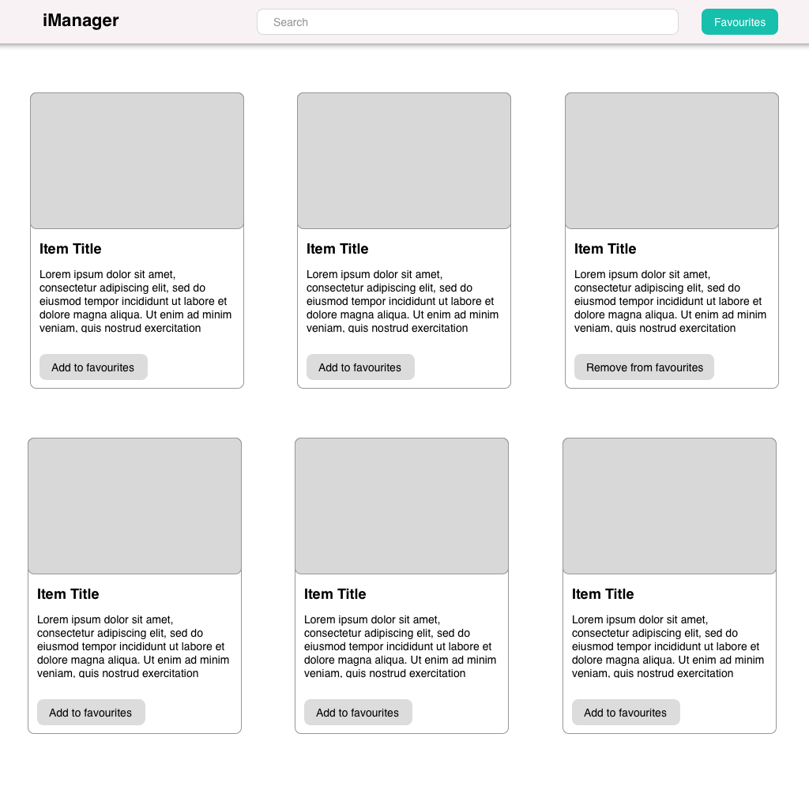

# iManager

This document describes the process of ideating, designing and implementing a basic (yet modern) frontend application.

# Development process

The process has been divided into four different phases that are fully documented here. Please note that this project follows a waterfall approach, because it needs to be short and only one iteration is expected. 

In case of receiving feedback and having a chance to improve the result, any improvements will be implemented iterating over the same four phases, resulting on a more agile approach. 

# Development phases

These are the phases that have led the project:

1. Ideation and definition: Which includes the project goal definition, user stories writing and the prototype creation.

2. Definition of technology and best practices strategy.

3. Application implementation: This phase includes the project scaffolding creation, testing and implementation.

4. Refining and automation: At this latest stage, the project has been refined and uploaded to a public repository. A basic CI has been also implemented to automate test execution.

# 1. Ideation and definition

## Project Goal

Offer to Item Managers an application with which allow them to find items on an inventory, and mark their favorites ones. 

All of this with a modern and intuitive user interface, and ensuring that best technical practices are followed during the implementation.

## Personas

As this is a small project, it has only one persona who is named as "Item Manager" in the user stories.

## User Stories

### Basic Interface

* **As an:** Item Manager,
* **I want to:** Have a basic and cohesionate user interface,
* **So that:** I can easily navigate through the application.

### List of Items

* **As an:** Item Manager,
* **I want to:** Be able to know existent items reading them from a list,
* **So that:** I can know the title, description, price and  owner's e-mail of each item, and also take a look of its photo.

### Items pagination

* **As an:** Item Manager,
* **I want to:** Be able to list items in group of fives, and move between groups (pages),
* **So that:** I can navigate between items in an easier way.

### Search Items

* **As an:** Item Manager,
* **I want to:** Be able to find items by title, description, price or e-mail,
* **So that:** I can easily find items.

### Sort items by title, description, price or e-mail

* **As an:** Item Manager,
* **I want to:** Be able to sort items by title, description, price or e-mail,
* **So that:** I can easily sort items.

### Save items as favourites

* **As an:** Item Manager,
* **I want to:** Be able to mark an item as favourite, from the main list,
* **So that:** I can later recover favourite items.

### Modal showing only title and picture

* **As an:** Item Manager,
* **I want to:** Access my favourite items and know their title and picture,
* **So that:** I can know which are my favourite items.

### Search by title in the modal of favourite items

* **As an:** Item Manager,
* **I want to:** Be able to search by title in my favourite items modal,
* **So that:** I can look for an specific item.

### Remove items from the favourite items list

* **As an:** Item Manager,
* **I want to:** Be able to remove items from my favourite list,
* **So that:** I can remove items that are no longer my favourite ones.

## Prototype

A basic low-fidelity prototype has been created using sketch. 

As prototyping was out of the scope of this project, the effort dedicated to this area has been minimum.

# 2. Technology and best practices strategy

## Tech stack and dependencies

These are the selected libraries to implement the project:

* **Webpack:** To group all app's files to bundle files.
* **Babel:** To transpile TypeScript, new Javascript features, and other things with compatibility purposes.
* **TypeScript:** To have an environment with types.
* **EsLint:** To automatically analyze the code style and fix it.
* **ReactJs:** As the main framework to build the app interface.
* **Recoil:** For a simple app state management.
* **Axios:** To perform http requests.
* **SCSS:** As a CSS pre-processor.
* **Jest & Enzyme:** To test implemented components.

## Best practices guidelines

There are a lot of good practices that could be implemented during an application design, but in this project we have focused on these topics:

* **Keep everything small:** 

  This means following the SRP in all possible aspects. Being sure that methods, classes, and components are small will increase the application mantainability.

* **Atomic components should be decoupled from the app:**

  Small components should be atomic, and should be able to work without requiring common dependencies from the application. 
  
  Although this rule has not been applied in a very strict way, it has guided the application development throughout the process.

* **Comment methods and complex decisions:** 

  To improve navigation through methods and make future developments easier, each method needs to be documented with JsDocs. 

  Also, code comments must reflect the reason behind complex or unobvious decisions, instead of describing what's making the code flow.

* **Test everything:** 

  Unit and integration tests are a must in this application. Everything should be tested to ensure that the application works as expected.

* **Use the adapter pattern whenever possible:** 

  As this is a basic application that could be evolved on a future to use a real api, it's a must to ensure that adaptor pattern is used, especially in those parts that connect the frontend app with third party systems or services.

# 3. Application implementation

This is a memory of all followed steps to implement the final application.

## Project initialization

### Creating the project

To simplify the number of required tools, `npm` is used as main package manager during all the development process.

As a first step, the project needs to be initialized with `npm init`.

### Webpack and babel installation

`webpack` dependencies need to be installed with the following command: 

- `npm i --save-dev webpack webpack-cli webpack-dev-server html-webpack-plugin`

Before configuring `webpack`, `babel` has been installed with the following command: 

- `npm i --save-dev @babel/core babel-loader @babel/preset-env @babel/preset-react @babel/preset-typescript @babel/plugin-transform-runtime`.

With these libraries, and after configuring them, the application will be able to be bundled and transpiled. 

After installing dependencies, basic `webpack` and `babel` configuration files have been created, and `start` and `build` scripts have been also added to the `package.json` file.

### Typescript React and Recoil installation

Now that we have `webpack` and `babel`, we need to install `typescript`, `react` and `recoil` dependencies: 

- `npm i typescript react react-dom recoil @types/react @types/react-dom`

### Basic files

To test that everything works as expected, a basic `index.html` file has been created in the project's root path, and an `index.tsx` has been created as the application entry point.

### Axios installation

After testing that the basic project compiling worked as expected, `axios` library has been installed with the following command:

- `npm i axios`

### SCSS

The following libraries have been installed to transpile scss to css using webpack: `style-loader`, `css-loader`, `sass-loader`, `sass`. 

- `npm i --save-dev style-loader css-loader sass-loader sass`

After installing these libraries, webpack's configuration file has been modified to process scss files.

### Testing libraries

Jest and Enzyme are used in this project to write unit and integration tests, to install these libraries, the following command has been executed:

- `npm i --save-dev jest babel-jest enzyme @wojtekmaj/enzyme-adapter-react-17 jsdom jsdom-global @types/jest @types/enzyme`

After installing these libraries, the `test-setup.js` file has been created to configure the enzyme adapter. Also, the `package.json` file has been modified to reference to the just created `test-setup.js` file.

### EsLint

EsLint is a static analyzer that ensures that the code style follows specific guidelines.

During this project, we'll use EsLint alongside with a Visual Studio Code plugin, to automatically fix the code when style errors are detected.

The following command has been executed to install EsLint in the project: 

* `npm i --save-dev eslint`

After that, the command `eslint --init` has ben runned to initialize EsLint. And the Visual Studio Code plugin has been also installed and configured to enable automatic error detection and correction.

### Project scaffolding

To organize and ensure project's tidiness, the following project scaffolding has been created:

* \_\_tests\_\_
* \_\_mocks\_\_
* components
* constants
* styles
* interfaces
* libs
* api

The purpose of each directory should be self-descriptive enough to understand the project. However, it's important to remark that these common folders only contain files that are required in more than one module of the project.

Components are as small, atomic and decoupled from the rest of the application as possible, so they have their required files and dependencies inside their own specific folder.

This should help ensuring a better decoupled environment, and increase the developer's focus while working on an specific component.

### Refinations

A `.gitignore` file has been created to ignore `node_modules` and `dist` directories.

After this, a git repository has been created to work on the project.

## Components creation

The first step in the implementation, has been to develop low-level visual components required in the application.

For this stage, prototype and user stories have been taken in consideration to know which components were required.

Components have been implemented by writing unit tests first, then making the real implementation, and finally manually testing the result (invoking the components from a browser) and refining the result, styles and the unit tests.

This is the order in which components have been developed, starting from the smaller ones:

* Button
* SearchBar
* Toolbar
* ItemCard
* ItemsGrid
* ItemsPager
* Modal

## Basic logic and state management

All components that implement the application logic or interact with the application state have been implemented on this stage.

* AppHandler
* ItemCardHandler
* ItemsPagerHandler
* ModalHandler

## Data retrieving

Two interfaces have been described to retrieve data:

* HttpClient: To describe the operations that a basic http client should implement. 
* ItemsApi: To describe the operations available to retrieve items and interact with them.

The first interface aims to offer an easy way to change the http client from axios to another if it's required in the future.

The second one aims to offer also an easy way to implement a real web service to retrieve items, and abstracts the sorting and filtering logic that at this moment is performed by the browser, but in a real environment will be likely performed by a web service.

# 4. Refining and automation

As a final step, the project has been made public in Github and the following tools have been configured to automate some tasks:

* Travis: To automatically test the project every time a commit is submited.
* Snyk: To automatically detect vulnerabilities and warn the author about them.
* Coveralls: To display a badge informing about the code coverage percentage in the repository.

These are the final steps completed on the project:

* Configure Travis as the CI runner.
* Add badges to the repository. 
* Configure coveralls.
* Install Cypress and create basic end to end tests. Add them to the Travis configuration file.